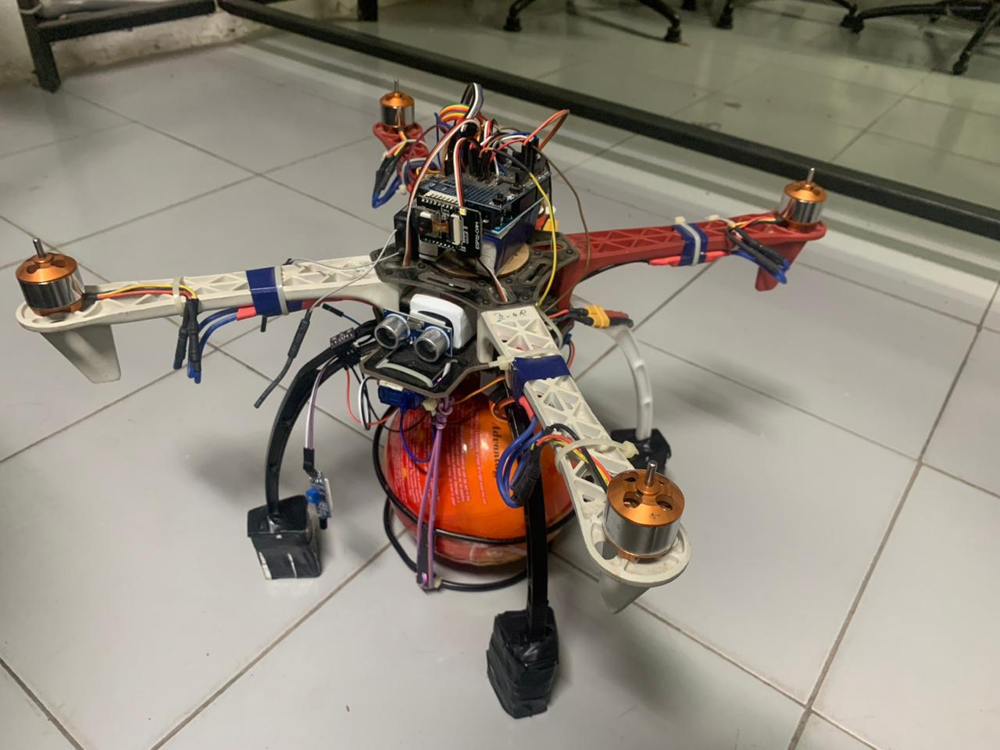
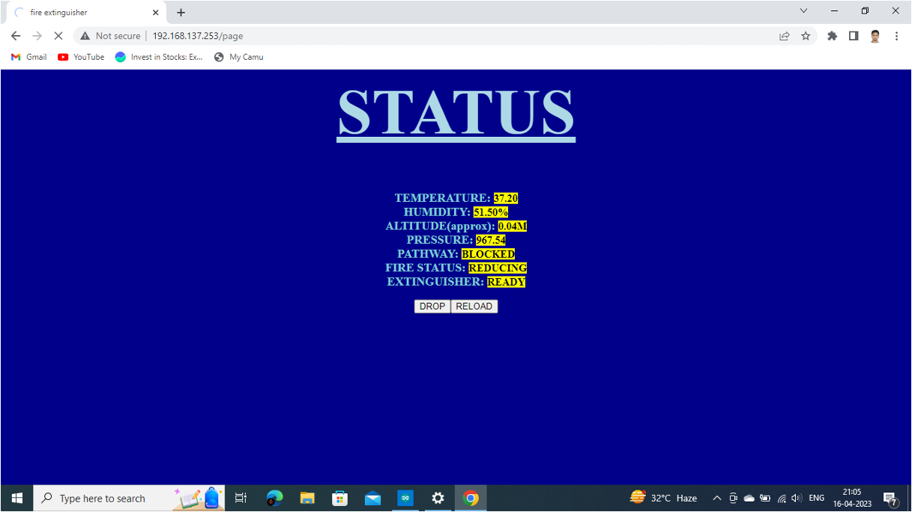
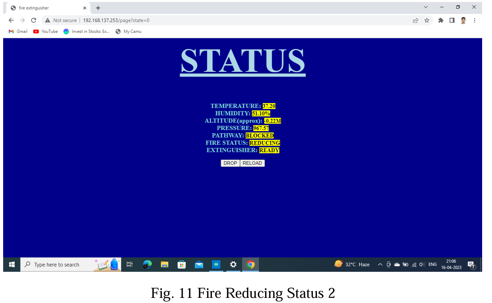
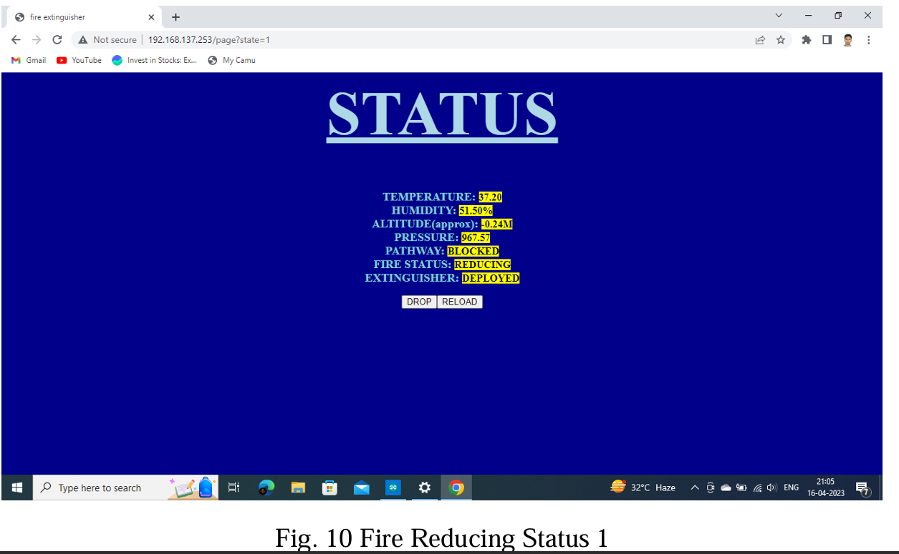

# wifi-fire-extinguishing-drone
Wi-Fi Enabled Fire Extinguishing Drone using ESP8266, ESP32-CAM and Quadcopter.

# Wi-Fi Enabled Fire Extinguishing Drone

A Wi-Fi-enabled firefighting drone developed to assist firefighters by remotely deploying a fire extinguisher ball while providing real-time environmental monitoring and live video streaming. The system combines embedded systems, IoT communication, and aerial robotics to improve safety during firefighting operations.

---

# Publication

This project has been published in the IEEE Xplore Digital Library.

**Paper Title:**
*WiFi Enabled Fire Extinguishing Drone* 

**Conference:**
2023 2nd International Conference on Advancements in Electrical, Electronics, Communication, Computing and Automation (ICAECA)

🔗 IEEE Xplore:
https://ieeexplore.ieee.org/document/10201153
https://doi.org/10.1109/ICAECA56562.2023.10201153
---

# Project Overview

Traditional firefighting methods expose firefighters to significant risks, especially in locations that are difficult to access. This project presents a low-cost firefighting drone capable of carrying and deploying a dry chemical fire extinguisher ball while transmitting live video and environmental information over Wi-Fi.

The system uses an Arduino UNO as the flight controller, an ESP8266 NodeMCU for IoT communication and web-based control, and an ESP32-CAM for live video streaming. Environmental conditions are continuously monitored using onboard sensors and displayed through a browser-based interface.

This project was developed as part of my Bachelor of Engineering (Electronics and Communication Engineering).

---

# Features

- Wi-Fi based remote monitoring
- Browser-based control interface
- Live video streaming using ESP32-CAM
- Remote fire extinguisher deployment
- Real-time temperature monitoring
- Real-time humidity monitoring
- Altitude measurement
- Lightweight embedded implementation
- Low-cost prototype

---

# Technical Highlights

- Developed the ESP8266 firmware for wireless communication.
- Designed the browser-based control dashboard.
- Integrated DHT22 and BMP280 sensors.
- Implemented remote fire extinguisher deployment.
- Interfaced ESP32-CAM for live monitoring.
- Performed hardware integration and prototype testing.

---

# Hardware Components

## Flight Platform

- Arduino UNO (Flight Controller)
- Quadcopter Frame
- 4 × Brushless DC Motors
- 4 × Electronic Speed Controllers (ESCs)
- Propellers
- Li-Po Battery
- Radio Transmitter & Receiver

## Fire Suppression System

- ESP8266 NodeMCU
- ESP32-CAM
- Servo Motor
- Fire Extinguisher Ball

## Sensors

- DHT22 Temperature & Humidity Sensor
- BMP280 Pressure & Altitude Sensor

## Communication

- Wi-Fi (ESP8266)
- ESP32-CAM Live Video Streaming

---

# Software Used

- Arduino IDE
- Embedded C++
- ESP8266WiFi Library
- ESP32-CAM Library
- HTML
- CSS
- JavaScript

---

# Working Principle

The project consists of two embedded subsystems:

## Flight Controller

The quadcopter is stabilized using an Arduino UNO-based flight controller. Four brushless DC motors driven through Electronic Speed Controllers (ESCs) provide lift and directional control.

The pilot navigates the drone manually to the target location.

---

## IoT Fire Suppression System

The ESP8266 NodeMCU hosts a web server that allows the operator to remotely monitor the drone and deploy the fire extinguisher.

The onboard sensors continuously monitor environmental conditions.

- **DHT22**
  - Temperature
  - Humidity

- **BMP280**
  - Pressure
  - Altitude

These sensor values are displayed on the web interface in real time.

An ESP32-CAM streams live video over Wi-Fi, allowing the operator to observe the fire before deploying the extinguisher.

Once the target is reached, pressing the **Deploy** button on the webpage commands the ESP8266 to rotate the servo motor, releasing the fire extinguisher ball. Upon impact, the ball disperses dry chemical powder to suppress the fire.

---

# My Contribution

This project was completed as a team project.

My primary contributions include:

- ESP8266 firmware development
- Wi-Fi communication
- Browser-based control interface
- Sensor integration
- Servo control logic
- Hardware integration
- Prototype assembly
- Testing and debugging

> **Note**
>
> The Arduino UNO flight controller firmware used in this project was based on an existing open-source implementation. My work focused on developing the ESP8266-based IoT subsystem, web interface, fire suppression mechanism, and system integration.

---

# Prototype



The completed firefighting drone prototype carrying the fire extinguisher deployment mechanism.

---

# Web Interface



The browser-based dashboard allows the operator to:

- View live sensor readings
- Monitor fire status
- Deploy the extinguisher
- Observe deployment status

---

# Fire Extinguisher Status

## Ready for Deployment



The extinguisher ball is secured beneath the drone and ready for deployment.

---

## After Deployment



After pressing the deployment button, the servo releases the extinguisher ball over the target area.

---

# Repository Structure

```
wifi-fire-extinguishing-drone
│
├── README.md
├── Project_Report.pdf
├── esp8266_fire_control.ino
│
├── prototype.jpeg
├── web_interface.png
├── extinguisherball_status_ready.png
└── extinguisherball_status_deployed.png
```

---

# Results

The prototype successfully demonstrated:

- Stable Wi-Fi communication
- Remote browser-based control
- Live video streaming
- Real-time environmental monitoring
- Successful deployment of the fire extinguisher ball
- Integration of multiple embedded subsystems into a working firefighting drone prototype

---

## Limitations

During field testing, the quadcopter demonstrated stable flight under normal conditions.

When carrying the fire extinguisher payload, the selected brushless motors were unable to generate sufficient thrust for sustained lift due to payload weight and budget constraints. This highlighted the importance of thrust-to-weight ratio in UAV design and provided valuable insights for future improvements.

Future versions would use higher-thrust motors and optimized weight distribution to enable reliable payload transport.

---

# Future Improvements

- Thermal camera integration
- Autonomous fire detection using AI
- GPS waypoint navigation
- Obstacle avoidance
- Autonomous target tracking
- Mobile application support
- Longer flight endurance
- Multiple fire extinguisher payloads
- Future improvements include:
- Higher-thrust motors
- Optimized weight distribution
- Improved PID tuning
- Landing assistance using additional sensors (e.g., ultrasonic or optical flow)

---

# Repository Contents

This repository contains:

- Project report
- ESP8266 source code
- Prototype images
- Web interface screenshots
- Fire suppression demonstration images

---

# Author

**Srinath S**

Bachelor of Engineering – Electronics and Communication Engineering

Master of Engineering – Embedded and Real-Time Systems
